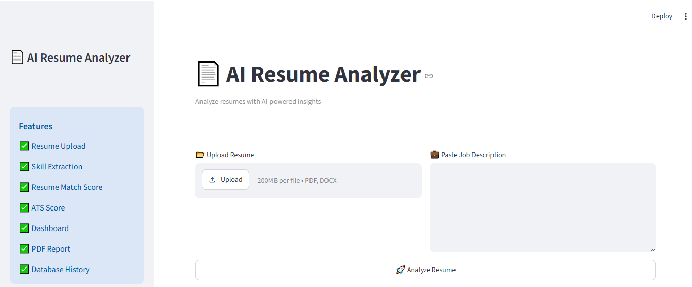
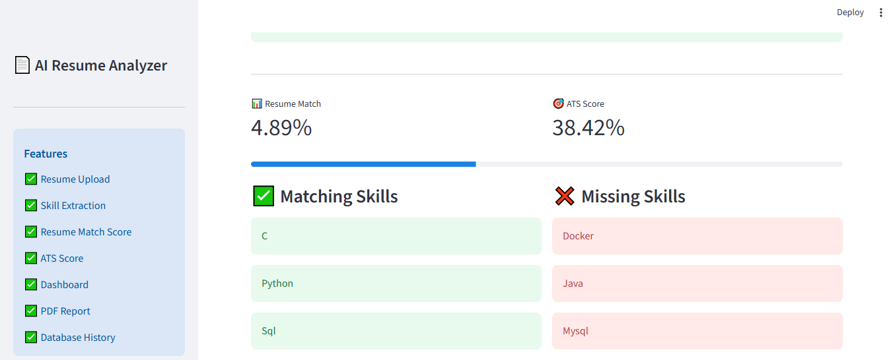
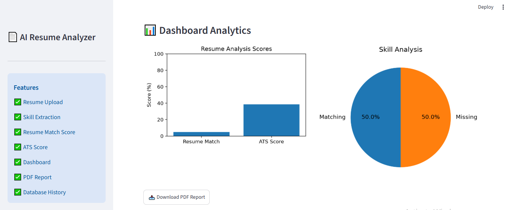
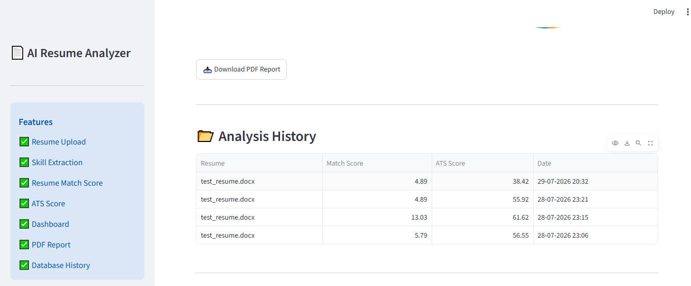

# 📄 AI Resume Analyzer

A modern AI-powered Resume Analyzer built using **Python**, **Natural Language Processing (NLP)** and **Machine Learning**.

It helps job seekers analyse their resumes against a Job Description by extracting skills, calculating resume similarity, estimating an ATS score, generating a PDF report, and storing previous analyses.

---

## 🚀 Features

- 📂 Upload Resume (PDF & DOCX)
- 📝 Resume Text Extraction
- 🧹 NLP Text Preprocessing
- 🛠 Skill Extraction
- 📊 Resume Match Score
- 🎯 ATS Score Calculation
- ✅ Matching Skills
- ❌ Missing Skills
- 💡 Resume Improvement Suggestions
- 📈 Dashboard Charts
- 📄 Download PDF Report
- 🗄 Analysis History using SQLite Database

---

## 🛠 Tech Stack

| Technology | Purpose |
|------------|---------|
| Python | Programming Language |
| Streamlit | Web Application |
| spaCy | NLP |
| Scikit-learn | Resume Matching |
| Pandas | Data Processing |
| Matplotlib | Charts |
| SQLite | Database |
| ReportLab | PDF Report |

---

## 📂 Project Structure

```text
AI-Resume-Analyzer/
│
├── app.py
├── README.md
├── requirements.txt
├── .gitignore
│
├── data/
│   └── skills.csv
│
├── screenshots/
│   ├── home.png
│   ├── analysis.png
│   ├── dashboard.png
│   └── history.png
│
├── utils/
│   ├── parser.py
│   ├── preprocess.py
│   ├── skills.py
│   ├── similarity.py
│   ├── ats.py
│   ├── charts.py
│   ├── database.py
│   └── pdf_report.py
```

---

## 📸 Screenshots

### 🏠 Home Page



### 📊 Resume Analysis



### 📈 Dashboard



### 🗄 Analysis History

